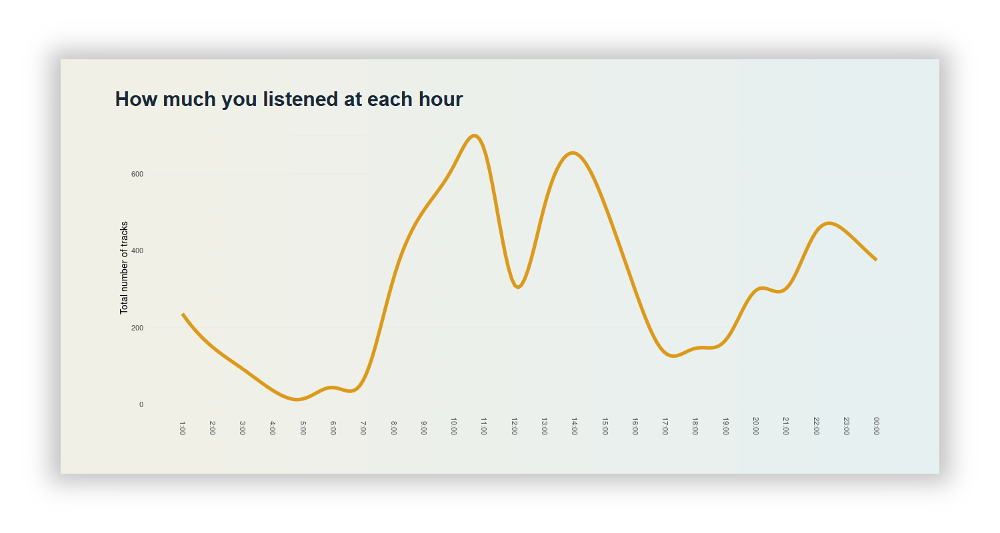

# explorify

This is a dashboard web app that visualises your listening history in Spotify, **without** the need to authenticate via API.

## Features

* top artists, tracks, genres
* total count of artists, tracks, listened time
* graphs that show your listening time hourly/weekly/monthly
* selecting a date range of the report

## Instructions

**Running locally:**

The app doesn't fetch any user related data from API, but only publicly available data. Thus, there's no need to require an user to login with Spotify. Hovewer, in order to make the app work, you have to put client ID and secret into the app. To obtain them, visit the [Spotify for Developers](https://developer.spotify.com/dashboard) site and create "new app" there.

Then, uncomment and populate lines regarding `client_id` and `client_secret` in the file **server.R** and run the file in RStudio. After you click "Run", you will be able to view the app in your browser.

**Using the app:**

You just have to upload a file named *StreamingHistory\*.json*, which you can obtain from [Spotify website](https://www.spotify.com/us/account/privacy/). The file contains your streaming history for the past year. If you have received more files, e.g. *StreamingHistory0*, *StreamingHistory1* etc., combine them into single JSON file in a text editor before upload.

You can see the app at [eluczak.shinyapps.io/explorify](https://eluczak.shinyapps.io/explorify).